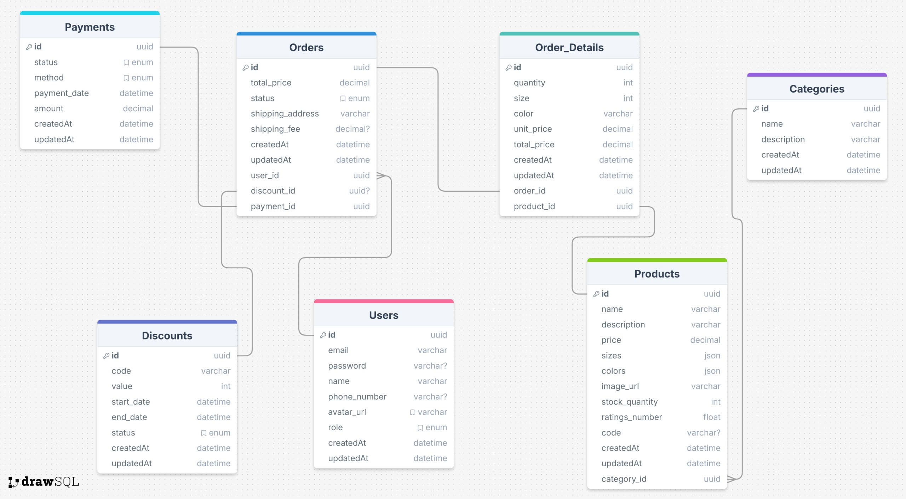

### HOW TO TEST BACKEND API???

1. Clone the project from GitHub.

2. Run **`npm i`** to install all necessary packages.

3. Create a `.env` file and copy all the variables from `.env.example` into the new `.env` file. Update the values of any empty variables to match your local database configuration.

4. Open the terminal and run the command:  
   **`npm run migration:generate -- src/database/migrations/Create-Database`**  
   to generate the migration file.

5. Once the file is generated, navigate to the database module, open the migrations folder, and review the auto-generated migration file.

6. Then, run the following command to apply the migration file to the database (create tables, constraints, etc.):  
   **`npm run migration:run`**

7. Next, run the command:  
   **`npm run start:dev`**  
   to start the server in development mode on localhost.

8. Finally, combine it with the instructions in the README.md file from the Frontend repository to test the API of the shoe store website!

Note: Wishing you an enjoyable experience with our team's shoe store website!

